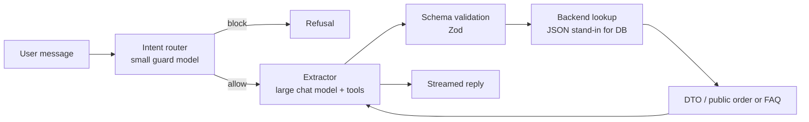

# Support bot

A proof of concept for a support chat. The bot answers order and policy
questions for a fictional store. A small guard model keeps requests on topic. A
larger model may call tools for orders and FAQ answers.

**Work in progress.** Not a production deploy.

## Request pipeline



| Stage             | In this repo                                                                                                                        |
| ----------------- | ----------------------------------------------------------------------------------------------------------------------------------- |
| Intent router     | `runGuardrails`: best-effort rate limit, input checks, then a small topic model (`GUARD_MODEL_ID`) that only decides ALLOW or BLOCK |
| Extractor         | Larger model (`CHAT_MODEL_ID`) with `getOrder` / `getFaq` tool calls                                                                |
| Schema validation | Zod tool input schemas, plus `validateUIMessages` on the server transcript                                                          |
| Backend           | Lookups against `data/orders.json` and `data/faq.json` (stand-in for a database)                                                    |
| DTO               | Public order shape / FAQ payload returned to the model                                                                              |
| Output            | Streamed reply rendered with Streamdown (word-by-word markdown and animation)                                                       |

The server stores the conversation. The client posts a chat id and the new user
turn only, so a forged tool result in the browser never reaches the model. Chat
ids are not bound to a signed-in user in this POC version.

## What the bot can do

- Order status, tracking and items when the customer gives order id **and** the
  email the order was placed with
- Written shop answers for returns, refunds, damage, contact and delivery
- Refuse off-topic questions, roleplay and prompt-injection style requests with
  a fixed refusal message

## Evals

Behaviour is measured with a golden set (~44 cases) instead of eyeballing
chats after a prompt change.

- **Contract tests** (`npm test`): no model. Request validation, forged tool
  parts, rate limit.
- **Eval suite** (`npm run eval`): hits the real `POST /api/chat` against
  Ollama. Cheap structural checks first (tool name, arguments, substrings,
  plain text). Cases that need it set `grounded: true` and a second **judge**
  model scores whether the reply sticks to tool output.
- Judge calibration runs first. If the judge does not agree with hand labels,
  the suite stops instead of burning minutes on untrustworthy grounding results.

A few cases are red on purpose (`knownFailure`) and document current model
limits.

## Stack

Next.js, Vercel AI SDK, Streamdown, Ollama, React, Tailwind, Zod, Vitest, Pino.

## Run locally

You need Node, [Ollama](https://ollama.com), and decent hardware. Model ids
live in `.env` (copy from `.env.example`). The pulls below are the models
this project was run with. You can set others in `.env` and pull those
instead.

```bash
cp .env.example .env
ollama pull qwen3.6:35b    # chat
ollama pull llama3.1:8b    # topic guard
ollama pull qwen2.5:32b    # grounding judge

npm install
npm run dev
npm test             # contract tests, no model
npm run eval         # full eval suite (few minutes depending on hardware)
npm run check        # format check, lint, typecheck, contract tests
```

## Layout

```
app/api/chat/     Chat route and contract tests
components/chat/  Chat UI
lib/guardrails.ts Intent router / input guards
lib/tools.ts      getOrder, getFaq
lib/chat-store.ts Server-owned transcript
data/             Fake order store and FAQ
evals/            Golden cases, runner, checks, judge
```
